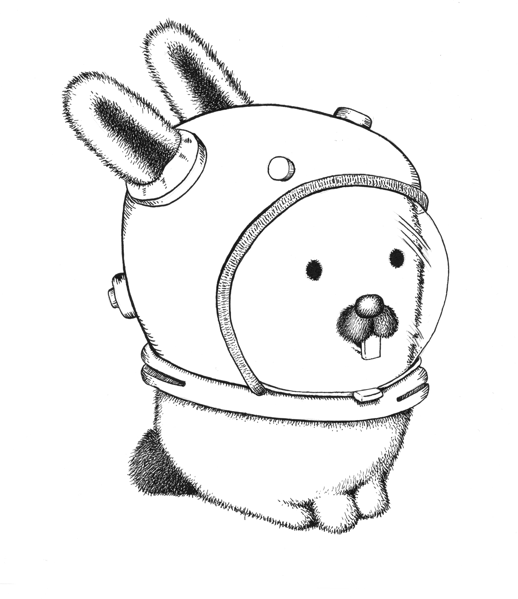

Hello everyone! I am **Mario Rosell**, a philosopher, programmer, computer sciencist, geek and writer
from Aragon, Spain.

# languages

- C
- Go
- Rc shell
- FORTH
- Assembly

# operating systems

- OpenBSD
- NetBSD
- FreeBSD
- **Plan 9 (overall: 9front)**

- **SOME** Linux distros:
	* Void Linux
   	* Crux linux
- UNIX SVR4
- Reserach UNIX

# tooling

- Acme
- [_`n`_]`vi`
- rc shell

See more at my [website](https://mariorosell.es).
